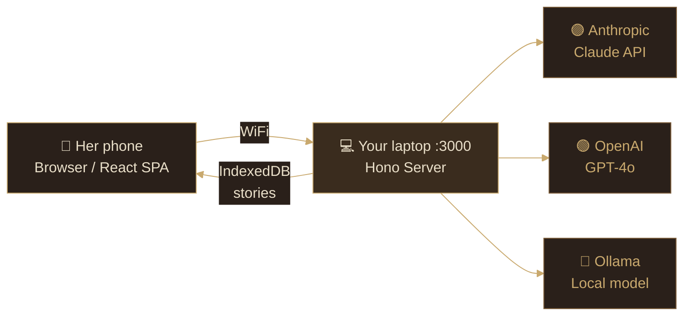
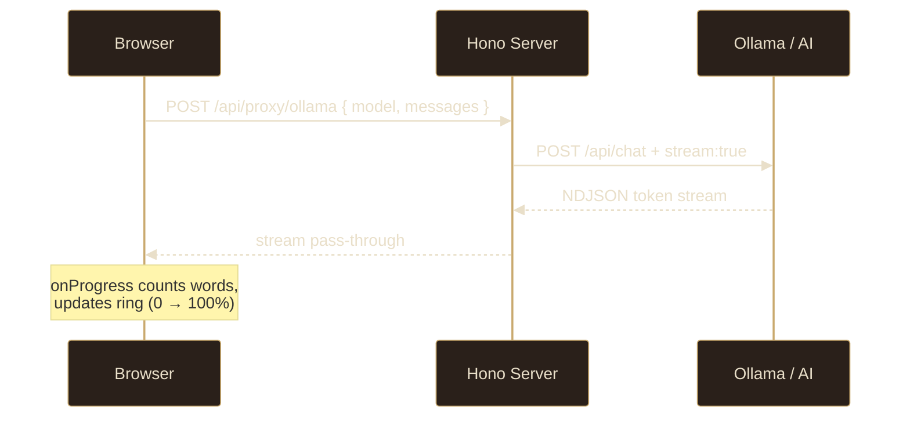
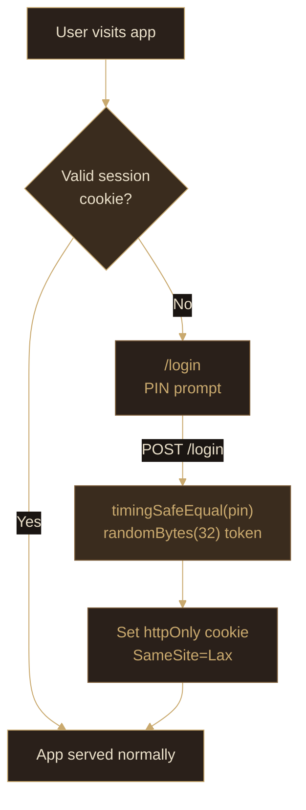
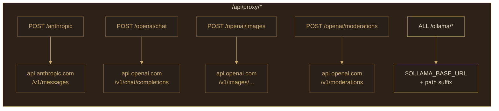
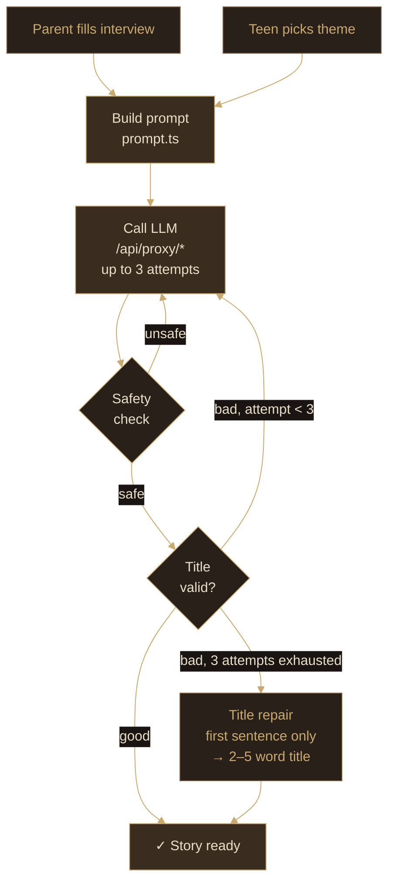
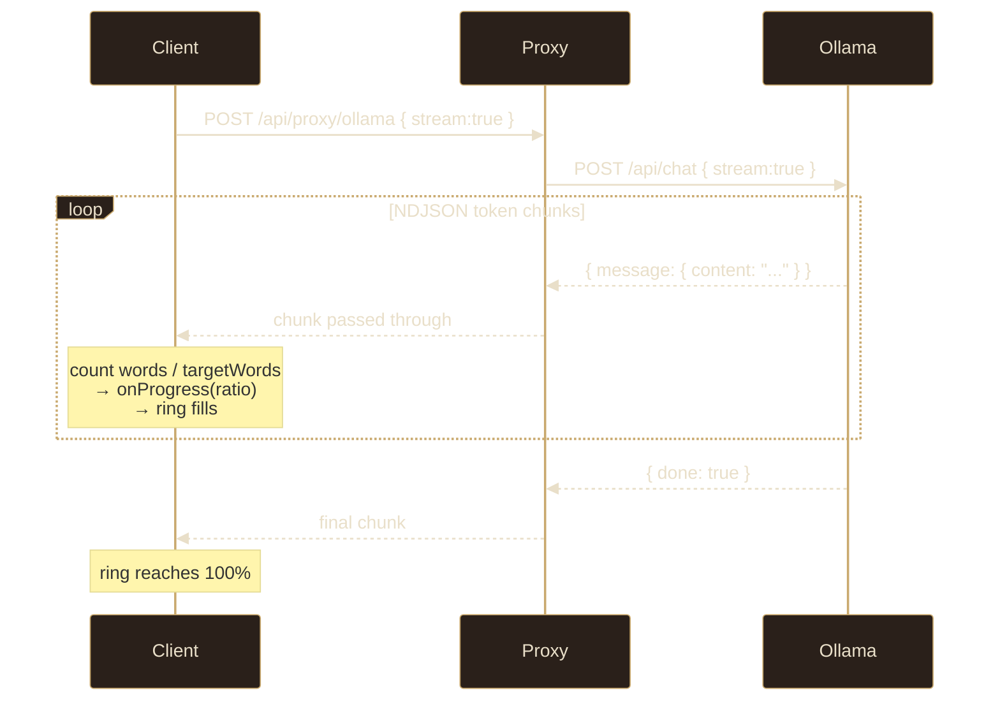
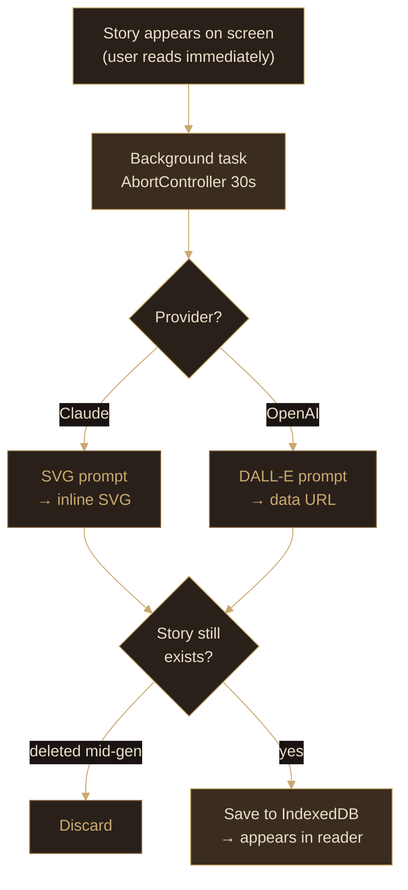
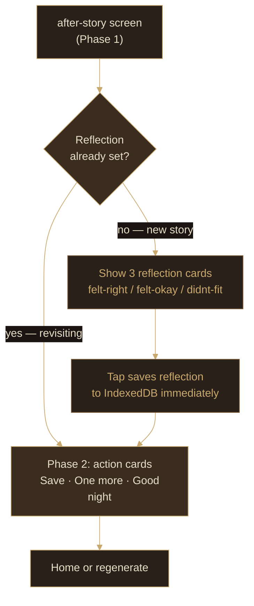
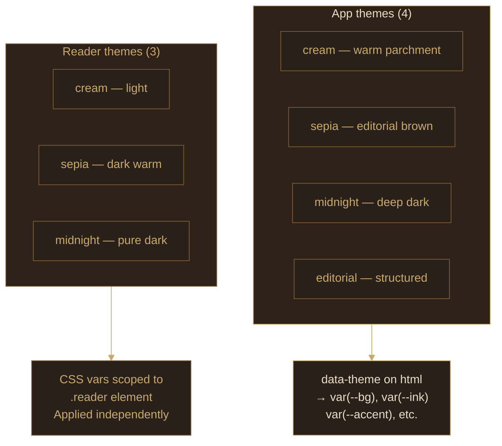
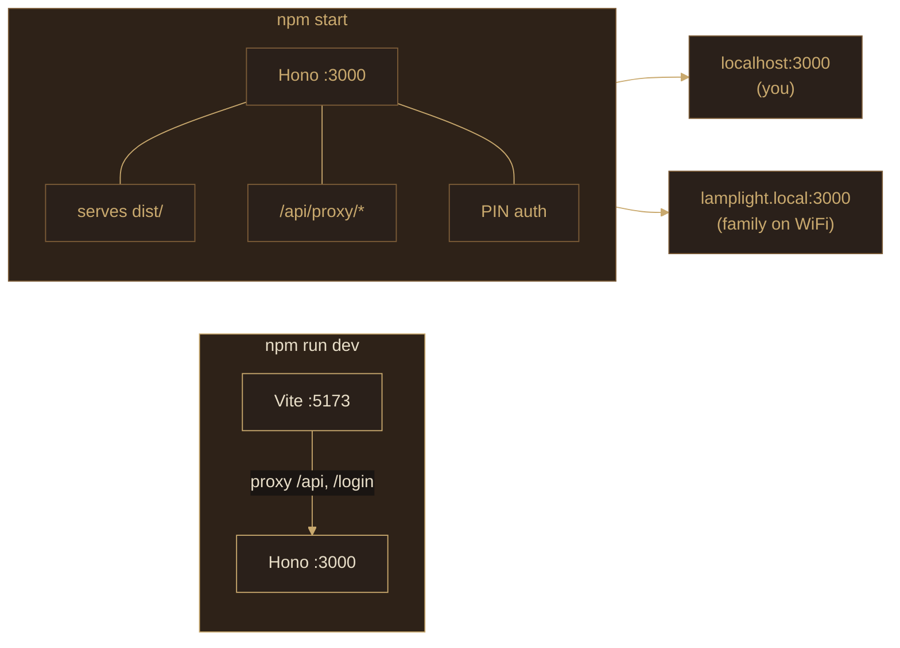

# Lamplight — Technical Reference

## Architecture

Lamplight is a React SPA served by a Hono server. The server does three things: PIN auth, AI proxy (injecting credentials), and static file serving. **The browser never holds an API key.**



---

## Request flow



---

## Authentication



**Cookie:** `lamplight_session`, `httpOnly`, `SameSite=Lax`, 1-year max-age  
Sessions live in memory — cleared on server restart (intentional, home network)  
API requests without session → `401`; browser requests → redirect to `/login`

---

## AI Proxy endpoints



Missing key → `503` (not a key leak). Client sends only the request body.

---

## Story generation pipeline



---

## Streaming progress (Ollama)

When `useLocal` is true, story generation uses `stream: true` so the Loading screen can show real progress.



---

## Illustration pipeline



---

## Client state machine

```mermaid
%%{init: {"theme": "base", "themeVariables": {"primaryColor": "#2a201a", "primaryTextColor": "#e9dfc9", "primaryBorderColor": "#c9a96e", "lineColor": "#c9a96e", "secondaryColor": "#1a1512", "background": "#1a1512", "mainBkg": "#2a201a", "nodeBorder": "#c9a96e", "fontFamily": "ui-serif, Georgia, serif"}}}%%
stateDiagram-v2
    [*] --> onb-welcome
    onb-welcome --> onb-profile
    onb-profile --> onb-llm
    onb-llm --> home
    home --> parent-q1
    home --> teen-themes
    home --> settings
    parent-q1 --> parent-q2
    parent-q2 --> parent-q3
    parent-q3 --> parent-q4
    parent-q4 --> loading
    teen-themes --> loading
    loading --> reading
    reading --> after-story
    after-story --> home
    after-story --> loading
    settings --> home
```

State is a string union (`Screen` type). No router library — the `screen` key drives a `switch` in `App.tsx`.

---

## Post-story reflection

After finishing a story the `after-story` screen runs a two-phase flow:



`Story.reflection` is an optional `'felt-right' | 'felt-okay' | 'didnt-fit'` field. It is persisted to IndexedDB on tap — before any navigation — so a fast swipe-away still records it.

---

## Read-aloud voice selection

Read-aloud supports two modes: **ElevenLabs** (cloud, higher quality) and **Web Speech API** (on-device, no key required). Both are implemented in `src/lib/tts.ts`.

### ElevenLabs voices (Bella & Lily)

Routed through a server-side proxy at `/api/proxy/elevenlabs/tts` so the API key is never exposed to the browser. Requires `ELEVENLABS_API_KEY` in `.env`.

| Voice | ElevenLabs voice ID | Character |
|---|---|---|
| Bella | `EXAVITQu4vr4xnSDxMaL` | Warm & friendly |
| Lily | `pFZP5JQG7iQjIQuC4Bku` | Bright & lively |

Uses `eleven_turbo_v2` model (low latency). Audio is streamed as `audio/mpeg`, played via `HTMLAudioElement`. Pause/resume is handled via `audio.pause()` / `audio.play()`.

### Web Speech API voices (Soft & Deep, on-device fallback)

**The Chrome/Android empty-voices bug:** `speechSynthesis.getVoices()` returns `[]` on the first call in Chrome until the `voiceschanged` event fires. `getVoicesReady()` handles this with a one-time listener.

**Voice priority order (woman / Soft persona):**

| Priority | Voice name | Platform |
|---|---|---|
| 1 | Ava (Enhanced) | macOS / iOS |
| 2 | Samantha (Enhanced) | macOS / iOS |
| 3 | Samantha | macOS / iOS |
| 4 | Microsoft Aria Online | Windows |
| 5 | Microsoft Jenny Online | Windows |
| 6 | Google UK English Female | Android Chrome |

Man / Deep persona follows the same pattern with Daniel / Tom / Fred / Microsoft Guy.

**Bedtime pacing settings:**

| Parameter | Value | vs. browser default |
|---|---|---|
| `rate` | `0.78` | Slower — more soothing |
| `pitch` | `0.92` | Slightly lower — warmer |
| `volume` | `0.90` | Slightly pulled back |

Voice persona (woman / man) is session-only state in `Reading.tsx` — not persisted.

---

## Theming system



---

## Dev vs production



---

## Environment variables

| Variable | Required | Default | Purpose |
|---|---|---|---|
| `APP_PIN` | ✅ Yes | — | PIN to enter the app |
| `PORT` | No | `3000` | Server port |
| `ANTHROPIC_API_KEY` | If using Claude | — | Anthropic API |
| `OPENAI_API_KEY` | If using OpenAI | — | OpenAI API |
| `OLLAMA_BASE_URL` | If using Ollama | `http://localhost:11434` | Ollama endpoint |
| `ELEVENLABS_API_KEY` | If using Bella/Lily voices | — | ElevenLabs TTS — free tier at elevenlabs.io |

Only set keys for the providers you use. Others can be omitted.

---

## Key dependencies

| Package | What it does |
|---|---|
| `hono` | Server framework (fast, TypeScript-native) |
| `@hono/node-server` | Node.js adapter for Hono |
| `react` + `react-dom` | UI |
| `idb` | IndexedDB with a promise API |
| `dotenv` | Loads `.env` into `process.env` |
| `vite` | Build tool + dev server |
| `tsx` | Runs TypeScript directly (server) |
| `concurrently` | Runs Vite + Hono together in dev |

---

## TypeScript setup

Two separate configs, two separate compilation targets:

```
tsconfig.json          (root, project references)
├── tsconfig.app.json  (client — bundler mode, DOM lib, jsx)
└── server/
    └── tsconfig.json  (server — NodeNext, node types, no jsx)
```

```bash
npx tsc --noEmit    # check both
npm run build       # tsc -b then vite build
```
